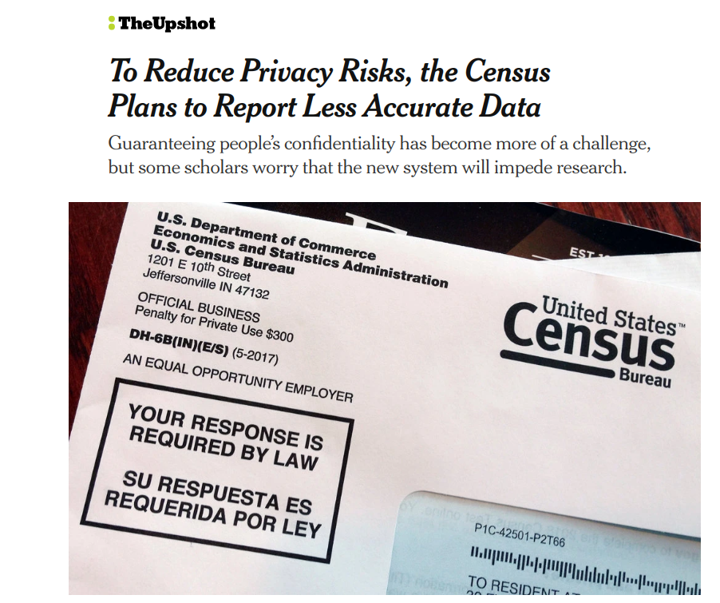

```{r setup, include=FALSE}
options(htmltools.dir.version = FALSE)
```

## What is an FSRDC?

* FSRDC: Federal Statistical Research Data Center

* Allows researchers to access __confidential__ US government datasets

---

## The Dallas-Fort Worth FSRDC


.footnote[Image source: Dallas Business Journal]

---

## The Dallas-Fort Worth FSRDC

* TCU: A __consortium member__ of the [DFW FSRDC](https://www.census.gov/about/adrm/fsrdc/locations/dfw.html)

* Researchers employed by consortium members can use the facility __without access fees__

* Fees for non-consortium member projects: __$20,000/year___

---
class: middle, center, inverse

## Data at the FSRDC

---

## Data at the FSRDC

Data sources include: 

* [United States Census Bureau](https://www.census.gov/ces/dataproducts/restricted_data.html)

* [Bureau of Labor Statistics](http://www.bls.gov/rda)

* [National Center for Health Statistics](https://www.cdc.gov/rdc/B2AccessMod/ACs220.htm)

* Other researcher and consortium-contributed datasets

---

## Advantages of FSRDC research

* Research question: what are the demographic characteristics of downtown movers?


---

## Public microdata geography


---

## Confidential microdata geography


---

## Why do research at the FSRDC?



.footnote[[Image source/article link](https://www.nytimes.com/2018/12/05/upshot/to-reduce-privacy-risks-the-census-plans-to-report-less-accurate-data.html)]

---

## The project approval process

* Contact the DFW RDC Administrator, Sam Bondurant (<samuel.r.bondurant@census.gov>) with your project idea

* Work with Sam to develop a proposal and submit for approval

* Apply for Special Sworn Status (SSS) with the U.S. Government

---

## Questions?

* Reach out to me at <kyle.walker@tcu.edu> - I'm happy to help!